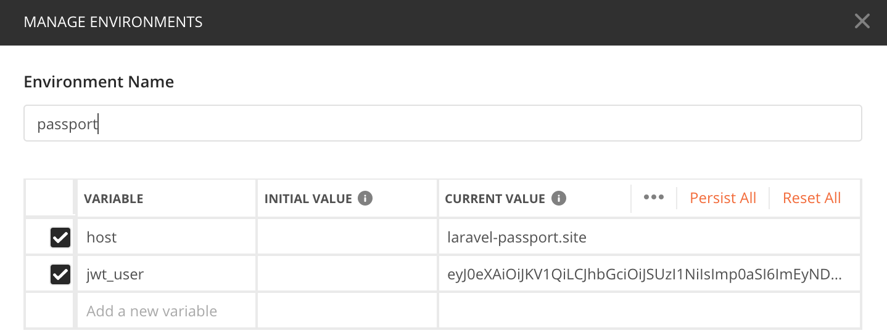
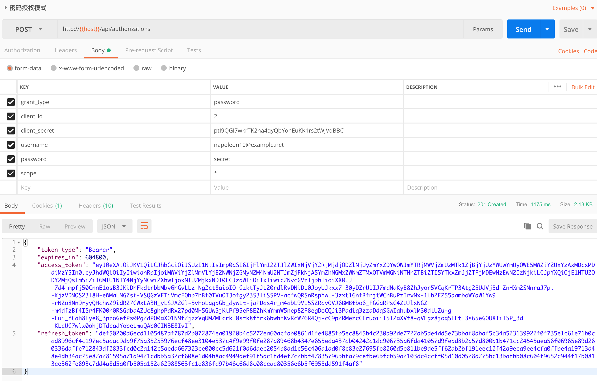
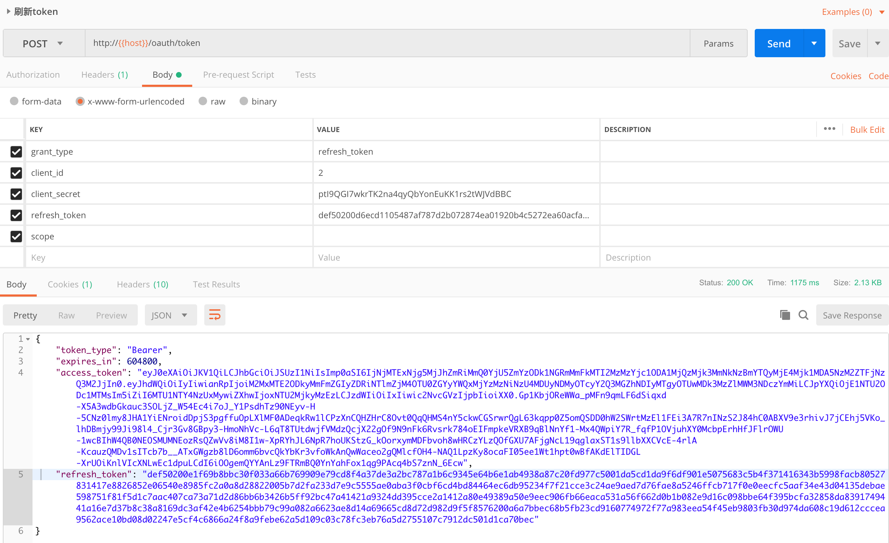

## PassPort Auth2.0 API
基于`Laravel Passport`实现`OAuth2.0`授权   封装`Resource` 完成统一`API`
 
## 下载项目

## 设置env项目配置

```
$ cp .env.example .env
``` 

## 扩展安装

```
$ composer install
```

## 数据库配置

```
$ php artisan migrate
```

> 数据库连接配置开发环境

## 生成访问秘钥

```
$ php artisan passport:install
```

## 创建客户端

```
$ php artisan passport:client --password --name='apkbus-ios'
```

## 执行项目初始化信息
```
$ php artisan thinker

$ namespace App\Models;
$ factory(User::class,10)->create();
```
## postman整体配置


## 登录token(数据库分配的客户端id&&secret)


## token刷新(refresh_token)
